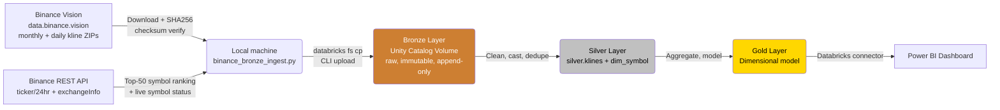

# CryptoLens 🕯️📊
### A Medallion Architecture Lakehouse for Crypto Market Data (Binance Vision Klines)

[](https://spark.apache.org/)
[](https://delta.io/)
[]()
[]()

> An end-to-end, automated data pipeline that ingests real historical and daily OHLCV (Open, High, Low, Close, Volume) candlestick data for the top 50 Binance USDT trading pairs, processes it through **Bronze → Silver → Gold** layers on Apache Spark / Delta Lake, and serves a Power BI dashboard for market analysts.

---

## 📌 Project Overview

| | |
|---|---|
| **Domain** | Financial Markets / Cryptocurrency Trading Analytics |
| **Data Source** | [Binance Vision](https://data.binance.vision) (historical klines) + [Binance REST API](https://binance-docs.github.io/apidocs/spot/en/) (`/ticker/24hr`, `/exchangeInfo`) |
| **Dataset** | Spot Klines (1-minute candles) for the **top 50 USDT pairs** by 24h quote volume, selected dynamically — not a hardcoded symbol list |
| **Platform** | Databricks Free Edition (Serverless SQL/Compute) — Apache Spark + Delta Lake + Unity Catalog Volumes |
| **BI Tool** | Power BI |
| **Team** | Abdullah Saeed & Arqum Umais |
| **Course** | Data Analysis and Visualization — Semester Project |

CryptoLens tracks price action and trading activity across the 50 most actively traded Binance USDT spot pairs so analysts can study volatility, trend, and cross-asset correlation — the kind of daily-cadence analysis a trading desk or research team relies on.

---

## 🏗️ Architecture



**Ingestion pattern:**
- **Full Load** — one monthly 1-minute kline file per tracked symbol (~43,200 rows/symbol/month) across all 50 tracked pairs (~200 MB total).
- **Incremental Load** — one daily 1-minute kline file per tracked symbol (~1,440 rows/symbol/day), refreshed on every pipeline run (~10 MB/day total).
- **Checksum verification** — every downloaded ZIP is SHA256-hashed and compared against Binance's own `.CHECKSUM` sidecar file before being trusted and extracted.
- **Network workaround** — Databricks Free Edition's serverless compute restricts outbound internet access to an internal allowlist that does not include Binance's domains. Downloading therefore runs on a local machine (`binance_bronze_ingest.py`), and verified files are pushed into the Bronze Unity Catalog Volume via the Databricks CLI (`databricks fs cp`) rather than being fetched directly from inside a notebook.
- **`dim_symbol` (new)** — Binance's `/exchangeInfo` endpoint is snapshotted on each run and merged into `dim_symbol`, since trading-pair status, listings, and delistings genuinely change over time. This gives the pipeline a real `MERGE` (insert + update + soft-delete), instead of the append-only kline data alone.

---

## 📂 Repository Structure

```
cryptolens/
├── docs/                    # Proposals, architecture diagrams, phase deliverables
│   └── Phase1_Project_Proposal_Crypto_Pipeline.docx
├── notebooks/               # Databricks notebooks, one per Medallion layer
│   └── 01_bronze_ingest.ipynb
├── .gitignore               # excludes bulk full_load/ and incremental_load/ data
└── README.md               
```

**Coming this phase:**
- `samples/` — one real, checksum-verified symbol (`BTCUSDT`, monthly + daily) with a schema README, replacing earlier placeholder samples
- `scripts/` — local-machine helpers (`binance_bronze_ingest.py` for bulk top-50 download, `prepare_samples.py` to extract the one representative sample pair) — these run outside Databricks due to the network restriction above
- `notebooks/02_silver_transform.py`, `notebooks/03_gold_aggregate.py`
- `dashboards/` — exported Power BI `.pbix` file

The bulk 50-symbol working dataset (`full_load/`, `incremental_load/`) is intentionally **not** committed to git — it's excluded via `.gitignore` and instead lives in the Databricks Unity Catalog Volume (`workspace.cryptolens.bronze_raw`), keeping the repository lean while the real analytical dataset still meets the required size thresholds.

---

## 🗃️ Data Model

### Bronze (Raw)
Landed as-is from Binance's headerless CSVs, tagged with `symbol`, `interval`, and `_ingestion_ts`, plus `_source_file`, `_load_type`, and `_checksum_verified` metadata. No casting or business logic — the immutable audit trail. Also includes raw `/exchangeInfo` JSON snapshots, one per pipeline run, feeding `dim_symbol`.

### Silver
**`silver.klines`** — one conformed fact table, one row per `(symbol, interval, open_time)`:

| Column | Type | Notes |
|---|---|---|
| `symbol`, `interval` | string | Derived from source file path |
| `open_time`, `close_time` | timestamp | Cast from epoch ms |
| `open`, `high`, `low`, `close` | DECIMAL(18,8) | Cast from fixed-point strings |
| `volume`, `quote_asset_volume` | DECIMAL(18,8) | |
| `num_trades` | integer | |
| `taker_buy_base_vol`, `taker_buy_quote_vol` | DECIMAL(18,8) | |

Key cleaning steps: header assignment, type casting, dedup on natural key (handles overlap between a daily incremental file and the following month's full-load file), and quality quarantine rules (`high < low`, `close` outside `[low, high]`, required-field nulls).

**`dim_symbol`** — one row per trading pair, maintained with a real `MERGE`:
- `WHEN MATCHED AND status/filters changed → UPDATE`
- `WHEN NOT MATCHED BY TARGET → INSERT` (new listing)
- `WHEN NOT MATCHED BY SOURCE → soft-delete` (`is_active = false`, `status = 'DELISTED'`)

### Gold (Dimensional Model)
- `dim_symbol` — conformed from Silver
- `dim_date` — standard calendar dimension
- `fact_daily_ohlcv` — daily bars rolled up from 1-minute Silver data
- `gold.volatility_daily` — daily returns + 7d/30d rolling realized volatility
- `gold.moving_averages` — 7d/30d SMA with golden/death-cross flags
- `gold.symbol_correlation` — rolling 30-day pairwise return correlation matrix

---

## 🔐 Security & Compliance

**No PII is present in this dataset.** Every field — OHLC, volume, trade count, and symbol status — is an aggregated, anonymous market statistic with no usernames, account IDs, wallet addresses, or IP addresses. Binance publishes both the historical klines and `exchangeInfo` as fully public, aggregated market data. Standard data-quality and governance controls (schema enforcement, immutable Bronze audit trail, workspace-level access control) are still applied through the Medallion layers. See `docs/` for the full justification.

---

## 📊 Dashboard (Power BI)

**Business questions answered:**
- How has each tracked asset's price and volatility trended over time?
- Which assets show a bullish (golden cross) or bearish (death cross) signal right now?
- How correlated are these assets, and is that correlation rising or falling?
- Which symbols have changed trading status (new listings, halts, delistings) recently?

**Planned visuals:**
- Price & volatility trend (line + shaded area, filterable by symbol)
- Moving-average crossover chart with flagged reversal points
- Rolling correlation heatmap (top 10–15 symbols by volume, for readability)
- `dim_symbol` status table — current + recently changed trading pairs
- *(Stretch)* KPI cards: 24h volume, 24h % change, trade count

---

## 💰 FinOps & Cost Awareness

- **Platform:** Databricks Free Edition — serverless compute, no idle cluster cost.
- **Download cost:** the heavy top-50 symbol download runs locally (not on billed Databricks compute); only the already-verified CSVs are uploaded into the Unity Catalog Volume.
- Notebooks are developed and unit-tested against the small files in `/samples` before running against the full ~200 MB backfill.
- Scope is fixed at the top 50 USDT pairs × 1-minute interval for the semester, sized to comfortably clear reviewer-set thresholds (~200 MB full load, ≥1 MB daily incremental) without ballooning further.
- `OPTIMIZE` / `Z-ORDER` used sparingly, only on Gold tables.
- Incremental job scheduled once daily, matching Binance's own publication cadence — no unnecessary cluster spin-ups.
- Fallback: Azure for Students credits if more headroom is needed for Phase 3 dashboard testing.

---

## 🗓️ Roadmap

- [x] **Phase 1** — Proposal, real checksum-verified sample data, architecture design, network-workaround documented *(26 Sep 2026)*
- [ ] **Phase 2** — Bronze/Silver/Gold pipeline implementation, `dim_symbol` MERGE logic *(due 10 Oct 2026)*
- [ ] **Phase 3** — Power BI dashboard + final delivery *(due 24 Oct 2026)*

---

## 👥 Team

| Name | Role |
|---|---|
| Abdullah Saeed (24L-2529) | Pipeline Engineering |
| Arqum Umais (24L-2591) | Data Modeling & BI |

---

## 📄 License

This project is for academic purposes as part of a "Data Analysis and Visualization" semester course. Source data © [Binance](https://www.binance.com/), published via [Binance Vision](https://data.binance.vision) for public research and analytical use.
