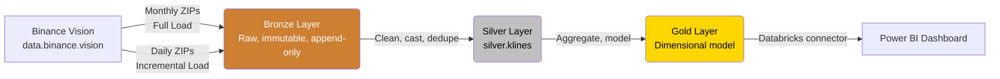

# CryptoLens 🕯️📊
### A Medallion Architecture Lakehouse for Crypto Market Data (Binance Vision Klines)

[](https://spark.apache.org/)
[](https://delta.io/)
[]()
[]()

> An end-to-end, automated data pipeline that ingests historical and daily OHLCV (Open, High, Low, Close, Volume) candlestick data for a curated basket of Binance USDT trading pairs, processes it through **Bronze → Silver → Gold** layers on Apache Spark / Delta Lake, and serves a Power BI dashboard for market analysts.

---

## 📌 Project Overview

| | |
|---|---|
| **Domain** | Financial Markets / Cryptocurrency Trading Analytics |
| **Data Source** | [Binance Vision](https://data.binance.vision) — Binance's official public historical market data archive |
| **Dataset** | Spot Klines (1-hour candles) for `BTCUSDT`, `ETHUSDT`, `BNBUSDT`, `SOLUSDT`, `XRPUSDT` |
| **Platform** | Databricks Community Edition (Apache Spark + Delta Lake) |
| **BI Tool** | Power BI |
| **Team** | Abdullah Saeed & Arqam Umais |
| **Course** | Big Data / Data Engineering — Semester Project |

CryptoLens tracks price action and trading activity across a fixed basket of Binance spot pairs so analysts can study volatility, trend, and cross-asset correlation — the kind of daily-cadence analysis a trading desk or research team relies on, built to stay well within free-tier Spark compute and storage limits.

---

## 🏗️ Architecture



**Ingestion pattern:**
- **Full Load** — one-time backfill of 18–24 months of monthly kline archives per symbol (append-only; closed candles never change).
- **Incremental Load** — a daily Databricks Job polls Binance Vision for the previous UTC day's file per symbol, verifies its `.CHECKSUM`, and appends it to Bronze.

---

## 📂 Repository Structure

```
cryptolens/
├── samples/              # Sample raw payloads (Full Load + Incremental Load)
│   ├── BTCUSDT-1h-2026-08-SAMPLE.csv
│   ├── BTCUSDT-1h-2026-09-25.csv
│   └── README.md          # Schema documentation for the samples
├── notebooks/             # Databricks notebooks, one per Medallion layer
│   ├── 01_bronze_ingest.py
│   ├── 02_silver_transform.py
│   └── 03_gold_aggregate.py
├── docs/                   # Proposals, architecture diagrams, phase deliverables
│   └── Phase1_Project_Proposal_Crypto_Pipeline.docx
├── dashboards/             # Exported Power BI (.pbix) file
└── README.md               # You are here
```

---

## 🗃️ Data Model

### Bronze (Raw)
Landed as-is from Binance's headerless CSVs, partitioned by `symbol` and `ingestion_date`, plus ingestion metadata: `_source_file`, `_ingestion_ts`, `_load_type`, `_checksum_verified`. No casting or business logic — the immutable audit trail.

### Silver — `silver.klines`
One conformed fact table, one row per `(symbol, interval, open_time)`:

| Column | Type | Notes |
|---|---|---|
| `symbol`, `interval` | string | Derived from source file path |
| `open_time`, `close_time` | timestamp | Cast from epoch ms |
| `open`, `high`, `low`, `close` | DECIMAL(18,8) | Cast from fixed-point strings |
| `volume`, `quote_asset_volume` | DECIMAL(18,8) | |
| `num_trades` | integer | |
| `taker_buy_base_vol`, `taker_buy_quote_vol` | DECIMAL(18,8) | |

Key cleaning steps: header assignment, type casting, dedup on natural key (handles overlap between a daily incremental file and the following month's full-load file), and quality quarantine rules (`high < low`, `close` outside `[low, high]`, required-field nulls).

### Gold (Dimensional Model)
- `dim_symbol` — one row per trading pair
- `dim_date` — standard calendar dimension
- `fact_daily_ohlcv` — daily bars rolled up from hourly Silver data
- `gold.volatility_daily` — daily returns + 7d/30d rolling realized volatility
- `gold.moving_averages` — 7d/30d SMA with golden/death-cross flags
- `gold.symbol_correlation` — rolling 30-day pairwise return correlation matrix

---

## 🔐 Security & Compliance

**No PII is present in this dataset.** Every field is an aggregated, anonymous market statistic (OHLC, volume, trade count) with no usernames, account IDs, wallet addresses, or IP addresses — Binance publishes this feed as fully aggregated public market data. Standard data-quality and governance controls (schema enforcement, immutable Bronze audit trail, workspace-level access control) are still applied through the Medallion layers. See `docs/` for the full justification.

---

## 📊 Dashboard (Power BI)

**Business questions answered:**
- How has each tracked asset's price and volatility trended over time?
- Which assets show a bullish (golden cross) or bearish (death cross) signal right now?
- How correlated are these assets, and is that correlation rising or falling?

**Planned visuals:**
- Price & volatility trend (line + shaded area, per symbol)
- Moving-average crossover chart with flagged reversal points
- 5×5 rolling correlation heatmap
- *(Stretch)* KPI cards: 24h volume, 24h % change, trade count

---

## 💰 FinOps & Cost Awareness

- **Platform:** Databricks Community Edition — free, single driver-only cluster, auto-terminate.
- Notebooks are developed and unit-tested against the small files in `/samples` before running against the full historical backfill.
- Scope is fixed at 5 symbols × 1h interval for the semester (~single-digit-to-low-tens of MB total) to stay well inside free-tier limits.
- `OPTIMIZE` / `Z-ORDER` used sparingly, only on Gold tables.
- Incremental job scheduled once daily, matching Binance's own publication cadence — no unnecessary cluster spin-ups.
- Fallback: Azure for Students credits if more headroom is needed for Phase 3 dashboard testing.

---

## 🗓️ Roadmap

- [x] **Phase 1** — Proposal, sample data, architecture design *(26 Sep 2026)*
- [ ] **Phase 2** — Bronze/Silver/Gold pipeline implementation *(due 10 Oct 2026)*
- [ ] **Phase 3** — Power BI dashboard + final delivery *(due 24 Oct 2026)*

---

## 👥 Team

| Name | Role |
|---|---|
| Abdullah Saeed | Pipeline Engineering |
| Arqam Umais | Data Modeling & BI |

---

## 📄 License

This project is for academic purposes as part of a Big Data / Data Engineering semester course. Source data © [Binance](https://www.binance.com/), published via [Binance Vision](https://data.binance.vision) for public research and analytical use.
