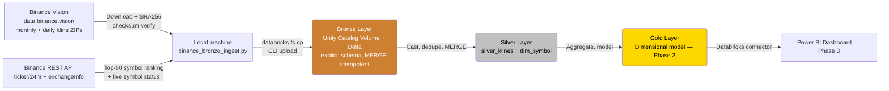

# CryptoLens 🕯️📊
### A Medallion Architecture Lakehouse for Crypto Market Data (Binance Vision Klines)

[](https://spark.apache.org/)
[](https://delta.io/)
[]()
[]()

> An end-to-end, automated data pipeline that ingests real historical and daily OHLCV (Open, High, Low, Close, Volume) candlestick data for the top 50 Binance USDT trading pairs, processes it through **Bronze → Silver → Gold** layers on Apache Spark / Delta Lake, and serves a Power BI dashboard for market analysts.

---

## 📌 Project Overview

| | |
|---|---|
| **Domain** | Financial Markets / Cryptocurrency Trading Analytics |
| **Data Source** | [Binance Vision](https://data.binance.vision) (historical klines) + [Binance REST API](https://binance-docs.github.io/apidocs/spot/en/) (`/ticker/24hr`, `/exchangeInfo`) |
| **Dataset** | Spot Klines (1-minute candles) for the **top 50 USDT pairs** by 24h quote volume, selected dynamically — not a hardcoded symbol list |
| **Platform** | Databricks Free Edition (Serverless SQL/Compute) — Apache Spark + Delta Lake + Unity Catalog Volumes |
| **BI Tool** | Power BI |
| **Team** | Abdullah Saeed & Arqum Umais |
| **Course** | Data Analysis and Visualization — Semester Project |

CryptoLens tracks price action and trading activity across the 50 most actively traded Binance USDT spot pairs so analysts can study volatility, trend, and cross-asset correlation — the kind of daily-cadence analysis a trading desk or research team relies on.

---

## 🏗️ Architecture



**Ingestion pattern:**
- **Full Load** — one monthly 1-minute kline file per tracked symbol (~43,200 rows/symbol/month) across all 50 tracked pairs (~200 MB total).
- **Incremental Load** — one daily 1-minute kline file per tracked symbol (~1,440 rows/symbol/day), refreshed on every pipeline run (~10 MB/day total).
- **Checksum verification** — every downloaded ZIP is SHA256-hashed and compared against Binance's own `.CHECKSUM` sidecar file before being trusted and extracted.
- **Network workaround** — confirmed via direct DNS resolution testing that Databricks Free Edition's serverless compute cannot resolve `api.binance.com` or `data.binance.vision` (while `pypi.org`/`github.com` resolve fine) — an environment-specific domain allowlist, not a full internet block. Downloading therefore runs on a local machine (`binance_bronze_ingest.py`), and verified files are pushed into the Bronze Unity Catalog Volume via the Databricks CLI (`databricks fs cp`).
- **`dim_symbol`** — Binance's `/exchangeInfo` endpoint is snapshotted and merged into `dim_symbol` in Silver, since trading-pair status, listings, and delistings genuinely change over time. This gives the pipeline a real `MERGE` (insert + update + soft-delete), instead of the append-only kline data alone.

---

## 📂 Repository Structure

```
cryptolens/
├── docs/                              # Proposals, data dictionary, phase deliverables
│   ├── Phase1_Project_Proposal_Crypto_Pipeline.docx
│   ├── CryptoLens_Phase2_Document.docx
│   └── CryptoLens_Data_Dictionary.pdf
├── notebooks/                         # Databricks notebooks, one per Medallion layer
│   ├── 01_bronze_ingest.ipynb
│   └── 02_silver_transform.ipynb
├── .gitignore                         # excludes bulk full_load/ and incremental_load/ data
└── README.md
```

**Coming next (Phase 3):**
- `samples/` — one real, checksum-verified symbol (`BTCUSDT`, monthly + daily) with a schema README
- `scripts/` — local-machine helpers (`binance_bronze_ingest.py`, `prepare_samples.py`) — run outside Databricks due to the network restriction above
- `notebooks/03_gold_aggregate.ipynb`
- `dashboards/` — exported Power BI `.pbix` file

The bulk 50-symbol working dataset (`full_load/`, `incremental_load/`) is intentionally **not** committed to git — it's excluded via `.gitignore` and instead lives in the Databricks Unity Catalog Volume (`workspace.cryptolens.bronze_raw`), keeping the repository lean while the real analytical dataset still meets the required size thresholds.

---

## 🗃️ Data Model

Full column-level definitions, types, and keys are in **[`docs/CryptoLens_Data_Dictionary.pdf`](docs/CryptoLens_Data_Dictionary.pdf)**. Summary:

### Bronze (`01_bronze_ingest.ipynb`)
- **`bronze_klines`** — raw kline rows, explicit schema (`StructType`, no `inferSchema`), tagged with `symbol`, `interval`, `load_type`, `source_file`, `load_timestamp`. Idempotent `MERGE` on `(symbol, interval, load_type, open_time)`.
- **`bronze_exchange_info`** — raw `/exchangeInfo` JSON snapshots, one per run, feeding `dim_symbol`.
- **`bronze_quarantine`** — rows that fail schema-on-read (PERMISSIVE mode + `_corrupt_record`) are routed here instead of crashing the batch.

### Silver (`02_silver_transform.ipynb`)
- **`silver_klines`** — one row per `(symbol, interval, open_time)`. Casts epoch-ms longs to `TIMESTAMP`, OHLCV to `DECIMAL(18,8)`. Idempotent `MERGE` (`WHEN MATCHED THEN UPDATE` / `WHEN NOT MATCHED THEN INSERT`) handles both re-runs and a full-load file later correcting an incremental-load value. Quality rules drop rows where `high < low` or `close`/`open` fall outside `[low, high]`.
- **`dim_symbol`** — maintained with a real three-branch `MERGE`: `UPDATE` on status/filter change, `INSERT` for new listings, soft-delete (`is_active = false`) for delistings — history is preserved, never hard-deleted.

### Audit (both layers)
- **`pipeline_execution_logs`** — one row per file/batch processed at every layer, every run: `layer`, `parameter_processed`, `load_type`, `start_time`/`end_time`, `status` (`SUCCESS`/`FAILURE`/`SKIPPED`), `rows_inserted`, `rows_updated`, `error_message`.

### Gold (Phase 3 — designed, not yet implemented)
- `dim_symbol`, `dim_date`, `fact_daily_ohlcv` (rolled up from 1-minute Silver data), `gold.volatility_daily`, `gold.moving_averages`, `gold.symbol_correlation`.

---

## ⚙️ Engineering Practices (Phase 2)

- **Strict schema-on-read** — every CSV/JSON read uses an explicit `StructType`; `inferSchema` is never used.
- **Idempotency** — every write path uses Delta `MERGE INTO`; re-running either notebook with identical parameters produces zero duplicate rows (verified by re-running twice and comparing row counts).
- **Parameterized backfills** — both notebooks expose `symbol`/`interval`/`load_type`/`year`/`month`/`day` as Databricks widgets; no function hardcodes "today," so any historical batch can be reprocessed on demand.
- **Schema drift handling** — PERMISSIVE CSV mode routes unparseable rows to `bronze_quarantine` rather than failing the batch; Delta writes use `mergeSchema=true` to tolerate newly-added columns.
- **Audit logging** — every file/batch processed, across both Full and Incremental loads and both layers, writes a row to `pipeline_execution_logs`.

Full writeup: **[`docs/CryptoLens_Phase2_Document.docx`](docs/CryptoLens_Phase2_Document.docx)**.

---

## 🔐 Security & Compliance

**No PII is present in this dataset.** Every field — OHLC, volume, trade count, and symbol status — is an aggregated, anonymous market statistic with no usernames, account IDs, wallet addresses, or IP addresses. Binance publishes both the historical klines and `exchangeInfo` as fully public, aggregated market data. Standard data-quality and governance controls (schema enforcement, immutable Bronze audit trail, workspace-level access control) are applied through the Medallion layers.

---

## 📊 Dashboard (Power BI) — Phase 3

**Business questions to answer:**
- How has each tracked asset's price and volatility trended over time?
- Which assets show a bullish (golden cross) or bearish (death cross) signal right now?
- How correlated are these assets, and is that correlation rising or falling?
- Which symbols have changed trading status (new listings, halts, delistings) recently?

**Planned visuals:**
- Price & volatility trend (line + shaded area, filterable by symbol)
- Moving-average crossover chart with flagged reversal points
- Rolling correlation heatmap (top 10–15 symbols by volume, for readability)
- `dim_symbol` status table — current + recently changed trading pairs
- *(Stretch)* KPI cards: 24h volume, 24h % change, trade count

---

## 💰 FinOps & Cost Awareness

- **Platform:** Databricks Free Edition — serverless compute, no idle cluster cost.
- **Download cost:** the heavy top-50 symbol download runs locally (not on billed Databricks compute); only the already-verified CSVs are uploaded into the Unity Catalog Volume.
- Scope is fixed at the top 50 USDT pairs × 1-minute interval for the semester, sized to comfortably clear reviewer-set thresholds (~200 MB full load, ≥1 MB daily incremental) without ballooning further.
- `OPTIMIZE` / `Z-ORDER` used sparingly, only on Gold tables (Phase 3).
- Incremental job scheduled once daily, matching Binance's own publication cadence — no unnecessary cluster spin-ups.
- Fallback: Azure for Students credits if more headroom is needed for Phase 3 dashboard testing.

---

## 🗓️ Roadmap

- [x] **Phase 1** — Proposal, real checksum-verified sample data, architecture design, network-workaround documented *(26 Sep 2026)*
- [x] **Phase 2** — Bronze & Silver notebooks implemented: explicit schemas, idempotent MERGE, parameterized backfills, schema-drift quarantine, audit logging *(10 Oct 2026)*
- [ ] **Phase 3** — Gold layer, Power BI dashboard, final delivery *(due 24 Oct 2026)*

---

## 👥 Team

| Name | Role |
|---|---|
| Abdullah Saeed (24L-2529) | Pipeline Engineering (Bronze layer) |
| Arqum Umais (24L-2591) | Data Modeling & BI (Silver layer, dashboarding) |

---

## 📄 License

This project is for academic purposes as part of a "Data Analysis and Visualization" semester course. Source data © [Binance](https://www.binance.com/), published via [Binance Vision](https://data.binance.vision) for public research and analytical use.
